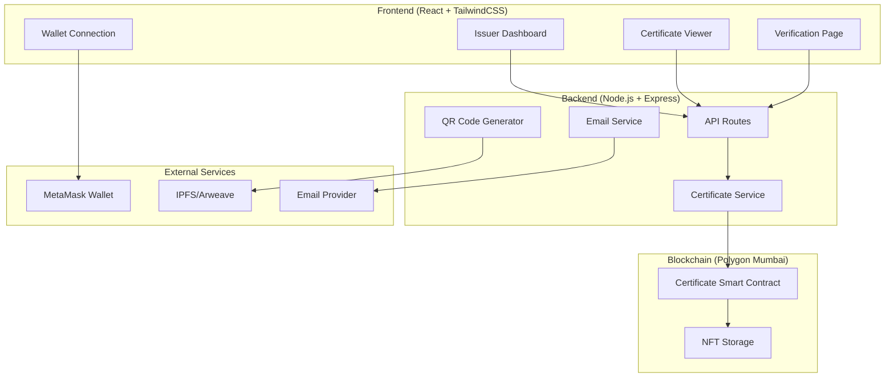

# Design Document

## Overview

VerifyCert is a decentralized certificate verification system built on Polygon Mumbai that enables institutions to issue tamper-proof digital certificates as non-transferable NFTs. The system consists of three main components: a Solidity smart contract for certificate storage and minting, a Node.js/Express backend API for business logic and blockchain interaction, and a React frontend with TailwindCSS for user interfaces.

The architecture follows a traditional web3 pattern where the frontend interacts with both the backend API and directly with the blockchain through MetaMask, ensuring both user experience optimization and decentralization benefits.

## Architecture

### High-Level Architecture



### Component Interaction Flow

1. **Certificate Issuance Flow:**
   - Issuer connects MetaMask wallet
   - Frontend validates issuer authorization
   - Issuer fills certificate form
   - Backend validates data and calls smart contract
   - Smart contract mints non-transferable NFT
   - Backend generates QR code and sends notification

2. **Certificate Verification Flow:**
   - User scans QR code or clicks verification link
   - Frontend queries smart contract directly
   - Certificate data displayed with authenticity confirmation

## Components and Interfaces

### Smart Contract (Certificate.sol)

**Purpose:** Handle certificate minting, storage, and verification on-chain

**Key Functions:**
```solidity
// Core certificate structure
struct Certificate {
    uint256 tokenId;
    address issuer;
    address recipient;
    string recipientName;
    string courseName;
    string institutionName;
    uint256 issueDate;
    string metadataURI;
    bool isValid;
}

// Main functions
function mintCertificate(address recipient, CertificateData memory data) external onlyAuthorizedIssuer
function getCertificate(uint256 tokenId) external view returns (Certificate memory)
function verifyCertificate(uint256 tokenId) external view returns (bool)
function authorizeIssuer(address issuer) external onlyOwner
function revokeCertificate(uint256 tokenId) external onlyIssuer
```

**Security Features:**
- Non-transferable implementation (override transfer functions to revert)
- Role-based access control for issuers
- Certificate revocation capability
- Input validation and sanitization

### Backend API

**Base URL:** `/api/v1`

**Core Endpoints:**

```javascript
// Certificate Management
POST /certificates/mint
GET /certificates/:tokenId
GET /certificates/issuer/:address
POST /certificates/verify/:tokenId

// Issuer Management  
POST /issuers/authorize
GET /issuers/dashboard/:address

// Utility
POST /qr-code/generate
POST /notifications/send
```

**Services:**

1. **CertificateService**
   - Blockchain interaction wrapper
   - Data validation and formatting
   - Error handling and retry logic

2. **QRCodeService**
   - Generate QR codes linking to verification pages
   - Store QR code images (IPFS/local storage)

3. **NotificationService**
   - Email certificate delivery
   - SMS notifications (future enhancement)

4. **AuthService**
   - Wallet signature verification
   - Issuer authorization checks

### Frontend Components

**Core Pages:**

1. **IssuerDashboard** (`/dashboard`)
   - Certificate issuance form
   - Issued certificates list
   - Institution statistics
   - Wallet connection status

2. **CertificateViewer** (`/certificate/:tokenId`)
   - Certificate display with styling
   - QR code for sharing
   - Download/share options
   - Blockchain verification status

3. **VerificationPage** (`/verify/:tokenId`)
   - Public certificate verification
   - Authenticity confirmation
   - Issuer information display
   - No wallet connection required

4. **WalletConnection** (Component)
   - MetaMask integration
   - Connection status management
   - Network switching (to Polygon Mumbai)

**Key React Components:**

```jsx
// Certificate display component
<CertificateCard 
  certificate={certificateData}
  showQR={true}
  isPublicView={false}
/>

// Wallet connection component
<WalletConnect 
  onConnect={handleConnect}
  requiredNetwork="polygon-mumbai"
/>

// Certificate form component
<CertificateForm 
  onSubmit={handleMint}
  isLoading={minting}
/>
```

## Data Models

### Certificate Data Structure

```typescript
interface Certificate {
  tokenId: string;
  issuer: string;
  recipient: string;
  recipientName: string;
  courseName: string;
  institutionName: string;
  issueDate: number;
  metadataURI: string;
  isValid: boolean;
  qrCodeURL: string;
  verificationURL: string;
}

interface CertificateMetadata {
  name: string;
  description: string;
  image: string;
  attributes: Array<{
    trait_type: string;
    value: string;
  }>;
}

interface IssuerProfile {
  address: string;
  institutionName: string;
  isAuthorized: boolean;
  certificatesIssued: number;
  joinDate: number;
}
```

### Database Schema (Optional - for caching)

```sql
-- Optional local database for performance
CREATE TABLE certificates_cache (
  token_id VARCHAR(255) PRIMARY KEY,
  issuer_address VARCHAR(42) NOT NULL,
  recipient_address VARCHAR(42) NOT NULL,
  recipient_name VARCHAR(255) NOT NULL,
  course_name VARCHAR(255) NOT NULL,
  institution_name VARCHAR(255) NOT NULL,
  issue_date TIMESTAMP NOT NULL,
  metadata_uri TEXT,
  qr_code_url TEXT,
  verification_url TEXT,
  is_valid BOOLEAN DEFAULT true,
  created_at TIMESTAMP DEFAULT CURRENT_TIMESTAMP,
  updated_at TIMESTAMP DEFAULT CURRENT_TIMESTAMP
);

CREATE INDEX idx_issuer ON certificates_cache(issuer_address);
CREATE INDEX idx_recipient ON certificates_cache(recipient_address);
```

## Error Handling

### Smart Contract Error Handling

```solidity
error UnauthorizedIssuer();
error InvalidRecipient();
error CertificateNotFound();
error CertificateAlreadyRevoked();
error TransferNotAllowed(); // For non-transferable enforcement
```

### Backend Error Handling

```javascript
// Standardized error response format
{
  "success": false,
  "error": {
    "code": "MINT_FAILED",
    "message": "Failed to mint certificate",
    "details": "Insufficient gas or network congestion"
  }
}

// Error categories
- VALIDATION_ERROR: Input validation failures
- BLOCKCHAIN_ERROR: Smart contract interaction failures  
- NETWORK_ERROR: Polygon network connectivity issues
- AUTHORIZATION_ERROR: Issuer permission failures
```

### Frontend Error Handling

```jsx
// Error boundary for blockchain operations
<ErrorBoundary fallback={<BlockchainErrorFallback />}>
  <CertificateOperations />
</ErrorBoundary>

// Toast notifications for user feedback
toast.error("Transaction failed. Please check your wallet and try again.");
toast.success("Certificate minted successfully!");
```

## Testing Strategy

### Smart Contract Testing

```javascript
// Using Hardhat and Chai
describe("Certificate Contract", () => {
  it("should mint certificate for authorized issuer");
  it("should reject minting from unauthorized address");
  it("should prevent certificate transfers");
  it("should allow certificate verification");
  it("should handle certificate revocation");
});
```

### Backend API Testing

```javascript
// Using Jest and Supertest
describe("Certificate API", () => {
  it("POST /certificates/mint - should mint with valid data");
  it("GET /certificates/:id - should return certificate data");
  it("POST /certificates/verify - should verify authentic certificate");
  it("should handle blockchain network errors gracefully");
});
```

### Frontend Testing

```javascript
// Using React Testing Library and Jest
describe("CertificateCard Component", () => {
  it("should display certificate information correctly");
  it("should show QR code when requested");
  it("should handle loading states");
  it("should display error states appropriately");
});

// E2E Testing with Cypress
describe("Certificate Issuance Flow", () => {
  it("should complete full issuance workflow");
  it("should verify certificate after minting");
});
```

### Integration Testing

- Test complete certificate lifecycle (mint → verify → revoke)
- Test wallet connection and network switching
- Test QR code generation and verification flow
- Test email delivery and link sharing

## Security Considerations

1. **Smart Contract Security:**
   - Reentrancy protection
   - Access control implementation
   - Input validation and sanitization
   - Gas optimization to prevent DoS

2. **Backend Security:**
   - Rate limiting on API endpoints
   - Input validation and sanitization
   - Secure environment variable management
   - CORS configuration

3. **Frontend Security:**
   - XSS prevention
   - Secure wallet connection handling
   - Input sanitization
   - HTTPS enforcement

4. **Blockchain Security:**
   - Non-transferable NFT implementation
   - Issuer authorization verification
   - Certificate revocation mechanism
   - Metadata immutability